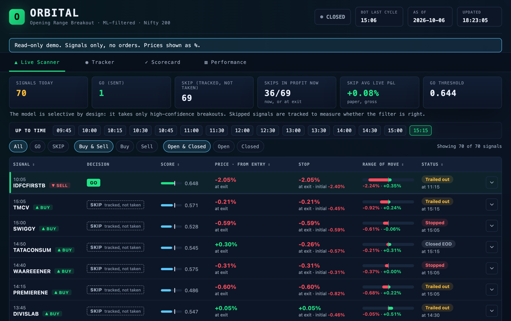
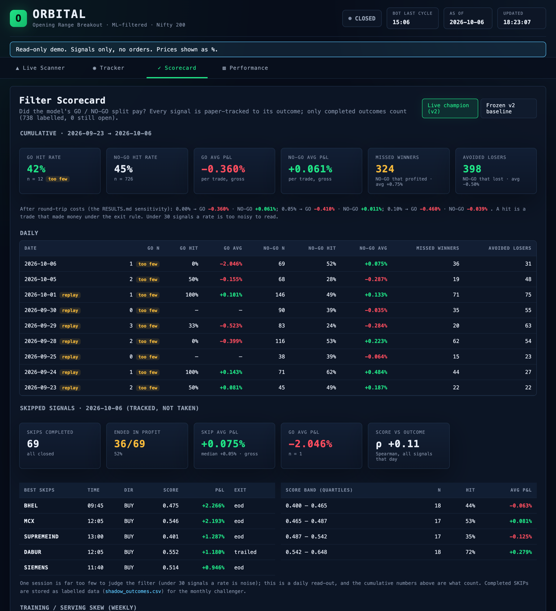
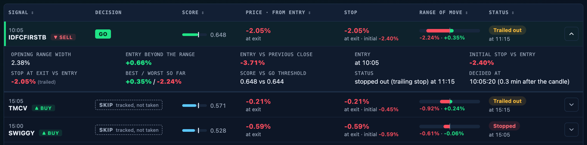

# ORBITAL — ML-filtered Opening Range Breakout for the Nifty 200



**Live demo: [https://orbital.68-233-96-25.sslip.io/guest](https://orbital.68-233-96-25.sslip.io/guest?k=PlkU9ablve5WLa3dEoRPPRT7d8QWmhAq)** — a read-only view of the live
dashboard: signals only, no orders, prices shown as % moves (see
[Guest view](#guest-view-and-dhans-terms)).

> B.Tech project. Research, not financial advice.

## What ORBITAL is

ORBITAL watches the Nifty 200 for **opening-range breakouts**, scores every
breakout with an **XGBoost** model, and sends only the top ~2% to Telegram.
It is **signals only**: it never places an order, and that is enforced in code
([below](#signals-only)). Every signal the model skips is still tracked on
paper to its outcome, so the filter is judged on what it turned down as well as
what it took.

The same code runs live and in the backtest, and the backtest is built to be
hard to fool: a point-in-time universe, monthly walk-forward retraining, a
pre-registered clean test, baselines and confidence intervals.

**Results:** [`docs/RESULTS.md`](docs/RESULTS.md) ·
**How the model decides:** [`docs/MODEL.md`](docs/MODEL.md) ·
**Pre-registration:** [`docs/PREREGISTRATION.md`](docs/PREREGISTRATION.md) ·
**Live bot edge cases:** [`docs/LIVE_EDGE_CASES.md`](docs/LIVE_EDGE_CASES.md) ·
**Study guide:** [`PROJECT_GUIDE.md`](PROJECT_GUIDE.md)

## Architecture

```
 DhanHQ market data (5-min candles, daily bars, quotes; read-only endpoints only)
      │
 dhan_client.py ── rate limit, retries, allowlist (/charts, /marketfeed)
      │
 history_cache.py ── on-disk candle cache, fetches only what's missing
      │
      ├──── RESEARCH ─────────────────────────────┐   ┌──── LIVE (every 5 min) ──────────────┐
      │  survivorship.py   point-in-time universe │   │  live_engine.py                      │
      │  build_historical_signals.replay_day ◄────┼───┼── same rules                         │
      │  features.py (28 inputs) ◄────────────────┼───┼── same features                      │
      │  walk_forward.py   monthly retrain        │   │  XGBoost score ≥ threshold → GO      │
      │  exits.simulate    every P&L number ◄─────┼───┼── shadow.py walks every signal       │
      │  report.py → docs/RESULTS.md              │   │  notifier.py → Telegram (GO only)    │
      └───────────────────────────────────────────┘   └──────────────┬───────────────────────┘
                                                                     │
                       webapp.py dashboard ◄── tracker.json, shadow log, scorecard
                       challenger.py (monthly) · drift.py (weekly) ◄── labelled shadow signals
```

One implementation of each step is shared by live and backtest: the entry
rules, the 28 model inputs and the exit rule. A test runs the live engine
cycle by cycle through a day and asserts it equals the batch replay, and over
11 real sessions the live code reproduced the backtest's 703/703 decisions.

```
 09:20–09:35   opening range forms (3 five-minute candles, all required)
      │
 every 5 min   on each COMPLETED candle, the rules check:
      │          close beyond the range  +  ±1.8% from yesterday's close  +  Fibonacci R1/S1
      ▼
   signal ──►  28 inputs (range geometry, volume, VWAP, volatility, sector, NIFTY, breadth)
      │
      ▼
   XGBoost ──► P(trade makes money under the exit rule)        (model v2)
      │
   score ≥ threshold ?  ── no ──►  SKIP: tracked on paper, not sent
      │ yes
      ▼
   Telegram:  entry, stop (1× range), trail (1× range), flat by 15:15
```

The threshold is not tuned by hand: it is the 98th percentile of scores on
recent out-of-sample data, so roughly the top 2% of signals are traded.

## The research story, with honest numbers

All P&L is per trade, **gross of costs** (realistic round-trip costs are
0.05–0.10%), under the same exit rule. Detail in
[`docs/RESULTS.md`](docs/RESULTS.md) and [`PROJECT_GUIDE.md`](PROJECT_GUIDE.md) §5–7.

1. **A broken label.** The first model predicted "hit the midpoint target"
   with AUC 0.81, yet that label had a 0.03 correlation with making money — a
   late entry could already be past the fixed target. Lesson: judge by P&L,
   not AUC.
2. **Lookahead, found six times.** Candle closes used at candle *start*,
   features including the entry bar, end-of-day breadth, a "top 1%" quantile
   taken over the whole test period, labels that could leak into inputs, and an
   ATR that included the day's own range. Fixing the first two alone cut the
   headline from +0.303% to +0.109% per trade. Each fix has a test that tampers
   with future candles and checks nothing changes.
3. **The pre-registered model (v1) failed.** The config was frozen and hashed
   before the 2022–23 data was downloaded. On that clean test v1 made
   **−0.027% per trade** over 676 trades (95% CI −0.082% to +0.032%; random
   picks from the same signals did as well 83% of the time). It ranked its
   label well, but higher scores meant *lower* P&L — a second proxy-label
   failure.
4. **v2 predicts profit directly — and was chosen after v1 failed.** In
   monthly walk-forward over 2023-09 → 2026-09 (the period it was designed on)
   it made +0.186% per trade on 1,202 trades, but its best month (2024-06) is
   48% of that P&L. **Without that month: +0.102% per trade on 1,142 trades**,
   against +0.062% for random picks from the same signals (p = 0.025) — an
   edge about the size of realistic costs. On 2022–23 (post-hoc for v2) its
   edge comes from one crash month (61% of its P&L; without it, +0.052%, the
   same as random picks).
5. **What holds up.** The entry rules alone beat a plain breakout and random
   entries in every period (clean test +0.054% per trade, 95% CI +0.027% to
   +0.083%), but that edge is below realistic costs.
6. **The forward test is running.** v2 has its own pre-registered forward test
   from 2026-09-23; the dashboard's scorecard tracks it, including every
   skipped signal. A dozen GO trades so far is far too few to read.

## Live dashboard

The scorecard compares what the model took (GO) with what it skipped, daily
and cumulatively, and reports the latest session's skips by score band:



Each row of the live scanner opens to show the opening range, the stop and
the timing behind the signal:



## Signals only

ORBITAL sends alerts; it has **no order path**, and that is enforced in code,
not config:

- `dhan_client.py` allows only Dhan's market-data endpoints (`/charts/…`,
  `/marketfeed/…`). Anything else — orders, super/forever orders, positions,
  holdings, funds, kill switch — raises `OrderPathBlocked` before a request is
  built. The HTTP session re-checks every URL to `api.dhan.co`, so a direct
  call is refused too.
- `tests/test_signals_only.py` fails if any trading endpoint is reachable or
  appears anywhere in the code; CI runs it on every push.

## Guest view and Dhan's terms

The live demo link opens `/guest?k=<key>`: the live scanner, tracker, scorecard
and performance tabs, read-only. It shows no prices at all — every price is
replaced by a % move (entry → now, stop distance, best and worst, range width),
in the pages and in their JSON; a test fails if a raw price or a rupee sign
appears anywhere in the guest view. Guests get no session and can't reach any
other page; requests are rate-limited, and every guest response is `noindex`
(`robots.txt` disallows the whole site). The key lives only on the server and
is rotated with `python guest.py rotate` (no restart needed).

**Is showing this allowed? Unconfirmed.** Dhan's
[Terms of Usage](https://dhan.co/terms/) (checked 2026-10-06) restrict
"Publishing any Dhan Platform's material in any other media" and "data
mining, data harvesting, data extracting or any other similar activity in
relation to the Dhan Platform", where the Dhan Platform is their website and
app. They say nothing explicit about data obtained through the DhanHQ APIs,
about derived figures such as % moves, or about personal versus commercial
use, and the [DhanHQ API docs](https://dhanhq.co/docs/v2/) link no separate
data licence. NSE's own data policy also governs redistribution of its market
data. The guest view therefore shows only derived % moves and the model's own
signals, never prices, and it would be taken down if Dhan or NSE objected;
written confirmation from Dhan has not been obtained.

## Shadow tracking, scorecard and model updates

- **Every signal is tracked, GO and NO-GO** (`shadow.py`). At signal time the
  bot logs the decision, the score, the threshold, both model versions and the
  28 inputs as the model saw them. Each signal is then walked through the
  session by the backtest's own exit engine (`exits.simulate`) on the candles
  the bot already fetches, and **labelled once**, only after its exit candle
  has closed. The label records its exit reason and time, P&L, and best and
  worst move.
- **Live scanner and tracker** (dashboard): today's signals in one table, GO
  first, with entry → now, the stop in force (initial, current, at exit), the
  best and worst move, and the status. They update after every price cycle
  (Server-Sent Events on the tracker, a 30 s refresh on the scanner).
- **Scorecard** (dashboard): GO vs NO-GO hit rate and average P&L, missed
  winners and avoided losers, both daily and cumulative. Fewer than 30 signals
  is flagged as too few to read.
- **Champion / challenger, monthly** (`challenger.py`, `registry.py`). On the
  first Saturday of each month a challenger is trained on all labelled data.
  It uses the walk-forward recipe, with date-grouped CV and leakage checks.
  It is compared with the champion on held-out months: the most recent
  complete months are pooled until both have at least 30 GO trades on the same
  window, and that whole window is excluded from both models' training. It is
  promoted only if it is better per GO trade at every cost level in RESULTS.md.
  The pooled months are logged. Every comparison is logged. The **v2 model stays frozen** as a
  baseline that scores every signal, and every signal records which versions
  scored it.
- **Weekly skew check** (`drift.py`, Saturdays). It compares live feature and
  score distributions with the training data, using PSI and Kolmogorov–Smirnov,
  and the live GO rate with the designed 2%. A feature counts as drifted only if
  its PSI also beats what a random stretch of history of the same length shows,
  because market-wide inputs barely vary within a day. Results go to the
  scorecard and RESULTS.md.
- Sessions before tracking began were replayed through the live engine
  (`shadow_backfill.py`) and are marked `replay`.
- **Exit rules are versioned** (`exits.RULES`). `exit_v1` is the live rule and
  produced every published number. A post-hoc variant, a 10-minute grace before
  the trailing stop can trigger (`exit_v2_grace10`), is walked for every live
  signal side by side, with its own labels that neither decide nor train
  anything; the dashboard has a what-if toggle and the scorecard compares the
  two. On the walk-forward signals it changes the model's trades by about
  +0.002% per trade (95% CIs include zero; [`docs/EXIT_GRACE.md`](docs/EXIT_GRACE.md)).
  A 5-minute grace is identical to `exit_v1`: the trail only moves after a
  candle is survived.

## Setup

```bash
python -m venv .venv && source .venv/bin/activate
pip install -r requirements.txt
cp config.example.ini config.ini          # then fill it in; config.ini is git-ignored
python fetch_symbols.py --refresh         # today's Nifty 200 + sector map from niftyindices.com
```

`config.ini` needs a Telegram bot token and chat id, plus **one** source of
Dhan credentials:

- `token_file`: a JSON token file that another service keeps fresh (how the
  VM runs; ORBITAL never logs in to Dhan itself), or
- `dhan_client_id` + `dhan_access_token`: a static token from web.dhan.co,
  for local research. It expires daily.

```bash
./start.sh                    # live bot + dashboard (http://127.0.0.1:5050); Ctrl+C stops both
./start.sh --dry-run          # same, but nothing is sent to Telegram
python main.py --session      # one trading session, closing snapshot at 15:40, then exit
python -m pytest              # ~160 tests
python run_pipeline.py        # rebuild every research result (~2 h first time, mostly downloads)
```

No market data ships with the repo: `data/` (Dhan candles, NSE lists) is
git-ignored and rebuilt by the commands above. The published results are
aggregates only (`docs/RESULTS.md`, `docs/summary.json`).

## Deployment

On a small VM, alongside another service that shares the Dhan account
(`deploy/`):

| Unit | What |
|---|---|
| `orbital.timer` → `orbital.service` | 09:15 IST on NSE trading days (holiday calendar via `ExecCondition`); `main.py --session`; restarts on failure; memory-capped |
| `orbital-web.service` | Dashboard under waitress on 127.0.0.1:5050, always on |
| `Caddyfile.orbital` | HTTPS in front of the dashboard; the dashboard has its own password page (`auth.py`: signed HttpOnly session cookie, lockout after 5 wrong tries) and the read-only guest view (`guest.py`) |

Dhan's 5 requests/s limit is per account, so on a shared account ORBITAL runs
at 3/s (`rate_per_sec`) and stays silent around each minute boundary
(`quiet_seconds`), when the other service makes its once-a-minute call.

## Repository map

| Area | File | What it does |
|---|---|---|
| **Config** | `strategy_config.py` | Every strategy parameter, frozen for the clean test |
| **Data** | `dhan_client.py` | DhanHQ API: live prices, 5-min and daily candles, rate limit, retries |
| | `history_cache.py` | On-disk candle cache; fetches only missing ranges; offline mode |
| | `survivorship.py` | Point-in-time Nifty 200 membership (survivorship-bias fix) |
| | `fetch_symbols.py` | Today's live universe (NSE constituent file; `--refresh` downloads it) |
| **Strategy** | `signal_generator.py` | The entry rules |
| | `build_historical_signals.py` | Replays the rules day by day (also used live) |
| | `features.py` | The 28 model inputs — one implementation for training and live |
| | `exits.py` | The one exit rule every result uses |
| **Research** | `mine_features.py` | Features + forward labels for every historical signal |
| | `walk_forward.py` | Monthly retrain-and-score; trains the live model |
| | `baselines.py`, `stats.py`, `report.py` | Baselines, bootstrap CIs, Sharpe, deflated Sharpe → `docs/RESULTS.md` |
| | `paper_trade.py` | Replays past sessions through the **live** code, cycle by cycle |
| | `explain_model.py` | SHAP explanation → `docs/MODEL.md` |
| | `run_pipeline.py` | Runs all of the above in order |
| **Live** | `live_engine.py` | Decision engine (completed candles → rules → features → model) |
| | `main.py` | The bot: 5-minute loop, Telegram, logs (`--session` for the systemd timer) |
| | `notifier.py` | Telegram messages and the sent log |
| | `webapp.py`, `auth.py`, `guest.py`, `charts.py`, `templates/`, `static/` | Dashboard, its login and the read-only guest view |
| **v1 research** | `train_classifier.py`, `experiments.py`, `sweep_exits.py` | The September 2026 exploration (label choice, exit sweep) on `data/research/v1/` |
| **Tests** | `tests/` | Rules, no-lookahead, live/backtest parity, exits, stats, plumbing, signals-only guard, real-data regression |
| **Deploy** | `deploy/`, `config.example.ini` | systemd units, Caddy site, logrotate; config template |
| **Archive** | `archive/` | Superseded code and data, kept for reference — not maintained |

## What makes the evaluation trustworthy

| Threat | Defence |
|---|---|
| Lookahead | Every feature uses only candles closed by entry time; tests tamper with future candles and assert nothing changes |
| Backtest ≠ live | Live bot calls the same `replay_day()` and `features.py`; a test runs the live engine every 5 minutes through a day and asserts it equals the batch replay |
| Survivorship bias | Universe rebuilt at every semi-annual rebalance from traded value (83% match to two real NSE lists); ETFs excluded |
| Overfitting the test | Config frozen and hashed **before** the clean periods were downloaded (`docs/PREREGISTRATION.md`) |
| Lucky split | Walk-forward: a fresh model every month, trained only on the past |
| Luck vs skill | Four baselines, day-block bootstrap CIs, permutation test vs random picks, deflated Sharpe ratio |
| Label leakage | Forward labels share a file with features; the trainer whitelists inputs; a test enforces it |

## Limitations

- The point-in-time universe is a **proxy** (traded value, not free-float market cap): ~83% overlap with the real index. It over-includes heavily traded mid-caps and misses a few large but quiet stocks. Companies that merged or delisted (e.g. HDFC Ltd) aren't in Dhan's data at all.
- P&L is **gross of costs**; `docs/RESULTS.md` shows sensitivity to 0.05% and 0.10% round-trip.
- Entries are assumed at the 5-minute candle close; stops at the stop price (no slippage model).
- Results are for the underlying stock. Option P&L is not modelled here.
- v2 enters many trades after 15:00 that last 5–15 minutes; a v3 with an earlier last-entry time is the obvious next registration.
- Dhan's most recent sessions currently lack their 15:15–15:25 candles, so recent trades exit at the 15:10 close.
- Dhan tokens expire daily (on the VM a separate service refreshes them); the daily bar is published late (handled with an official-OHLC snapshot after the close).
