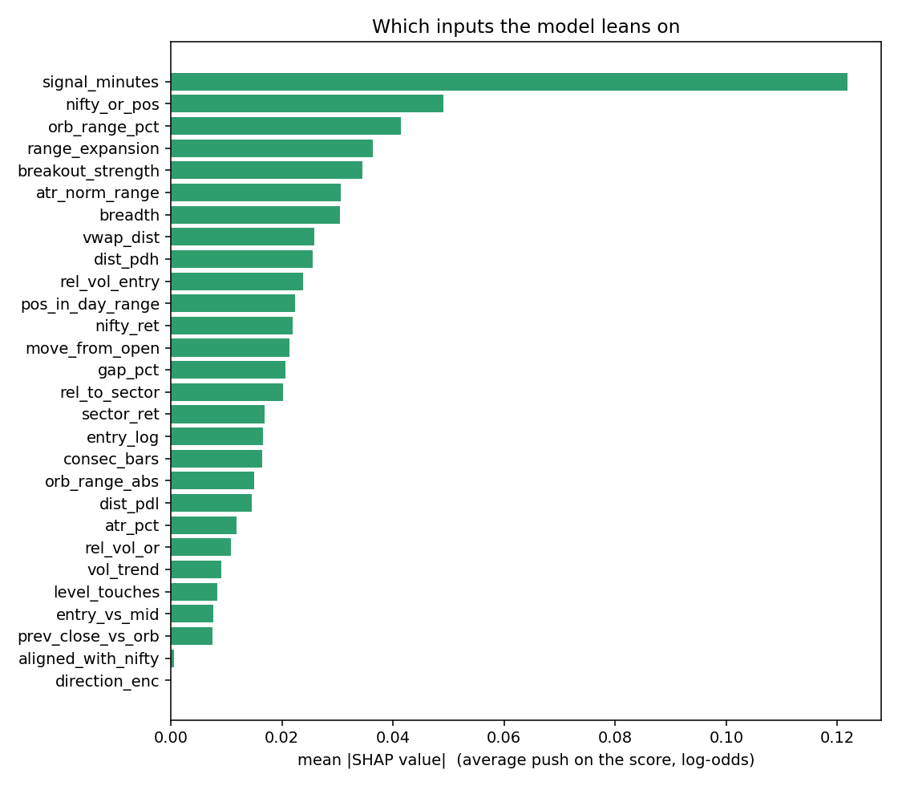
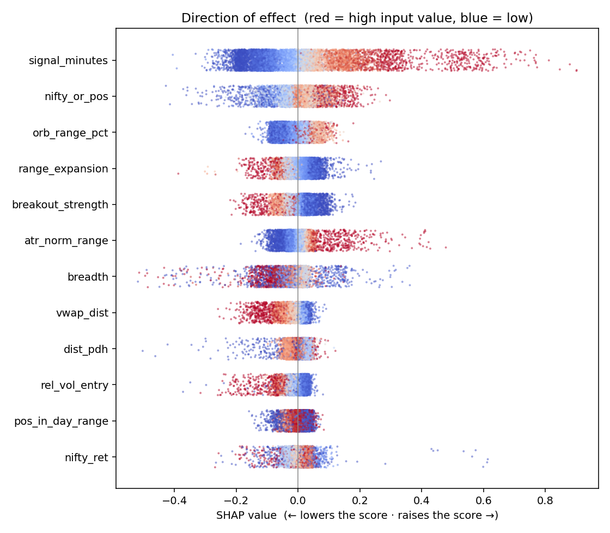

# How the model decides

Model: XGBoost, trained through **2026-09-22**, 28 inputs, GO threshold **0.644**. Explained on 8,000 historical signals with exact tree SHAP values (`explain_model.py`).

A SHAP value is how far one input moved one prediction away from the model's average, in log-odds. Averaging their size shows what the model relies on; comparing them with the input's value shows the direction.

## The ten inputs that matter most

| # | Input | Meaning | Mean \|SHAP\| | Higher value → |
|---|---|---|---|---|
| 1 | `signal_minutes` | minutes since 09:15 | 0.122 | raises the score |
| 2 | `nifty_or_pos` | NIFTY vs its own opening range | 0.049 | raises the score |
| 3 | `orb_range_pct` | opening-range width, % of price | 0.041 | raises the score |
| 4 | `range_expansion` | last 3 candles' size vs the day so far | 0.036 | lowers the score |
| 5 | `breakout_strength` | how far past the range the entry is (in ranges) | 0.034 | lowers the score |
| 6 | `atr_norm_range` | opening range in daily ATRs | 0.031 | raises the score |
| 7 | `breadth` | share of the index above its open | 0.030 | mixed / non-linear |
| 8 | `vwap_dist` | distance past VWAP, in the trade's direction | 0.026 | lowers the score |
| 9 | `dist_pdh` | distance from yesterday's high | 0.025 | mixed / non-linear |
| 10 | `rel_vol_entry` | breakout candle volume vs the day so far | 0.024 | lowers the score |

## Two decisions, taken apart

**A GO decision** — LTF SELL on 2024-06-04 at 10:50:00, score 0.921 (threshold 0.644).

| Input | Value | Push |
|---|---|---|
| `nifty_ret` | -2.604 | +0.563 |
| `atr_norm_range` | 1.191 | +0.428 |
| `nifty_or_pos` | 0.393 | +0.264 |
| `breadth` | 0.106 | +0.246 |
| `signal_minutes` | 95.000 | +0.173 |
| `move_from_open` | 5.875 | +0.156 |

**A typical SKIP** — NCC SELL on 2022-02-15 at 09:45:00, score 0.495 (threshold 0.644).

| Input | Value | Push |
|---|---|---|
| `signal_minutes` | 30.000 | -0.191 |
| `vwap_dist` | 2.151 | -0.089 |
| `atr_norm_range` | 0.792 | +0.083 |
| `nifty_or_pos` | -0.224 | -0.075 |
| `move_from_open` | 4.329 | +0.072 |
| `gap_pct` | -1.716 | +0.044 |

## Caveats

- SHAP explains the model, not the market: a big contribution means the model relies on that input, not that the input causes returns.
- Correlated inputs (e.g. `breakout_strength`, `entry_vs_mid`, `move_from_open`) share credit between them, so individual ranks among them are not stable.
- This is the live model. Each walk-forward month has its own model whose emphasis can differ.