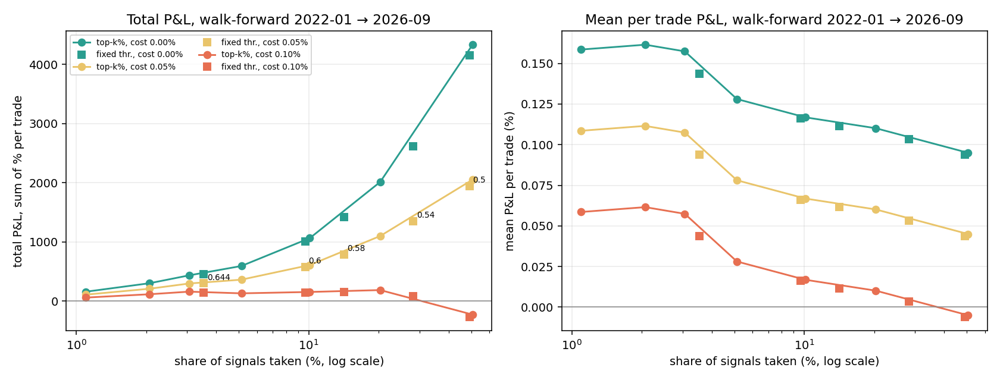

# GO threshold — results

Follows [`THRESHOLD_PROTOCOL.md`](THRESHOLD_PROTOCOL.md) (committed before anything below ran). **Exploratory:** these months were examined while v1 and v2 were built.

## Step 5: threshold sweep (walk-forward, 2022-01 → 2026-09-22)

Integrity check: top 2% reproduces v2's published walk-forward GO trades: 1,863 of 1,863 identical, 1,863 in total.

Top k%: each month's threshold is that month's model's (100 − k)th calibration percentile (data before the month only). Fixed: GO when that month's model scores at or above the number. P&L in % per trade (gross; the cost columns subtract a flat round trip); totals are sums over trades.

### clean_backward (2022-01-01 → 2023-08-31)

| Setting | Share | Trades | /day | Hit | Mean 0% | Mean 0.05% | Mean 0.10% | Total 0% | Total 0.05% | Total 0.10% | Worst month | Total 0.05% w/o best month | Mean 0.05% w/o best month |
|---|---|---|---|---|---|---|---|---|---|---|---|---|---|
| top 1% | 1.1% | 349 | 0.85 | 49.6% | +0.137% | +0.087% | +0.037% | +47.8 | +30.4 | +12.9 | -6.4 | -8.2 | -0.028% |
| top 2% | 2.0% | 647 | 1.57 | 51.5% | +0.115% | +0.065% | +0.015% | +74.2 | +41.8 | +9.5 | -9.0 | +1.0 | +0.002% |
| top 3% | 3.1% | 987 | 2.40 | 51.1% | +0.133% | +0.083% | +0.033% | +131.0 | +81.7 | +32.3 | -6.4 | +39.2 | +0.045% |
| top 5% | 5.3% | 1,682 | 4.08 | 50.0% | +0.119% | +0.069% | +0.019% | +200.5 | +116.4 | +32.3 | -11.4 | +73.7 | +0.050% |
| top 10% | 10.1% | 3,223 | 7.82 | 48.6% | +0.104% | +0.054% | +0.004% | +335.4 | +174.3 | +13.1 | -20.3 | +111.2 | +0.039% |
| top 20% | 20.1% | 6,408 | 15.55 | 47.5% | +0.100% | +0.050% | -0.000% | +638.3 | +317.9 | -2.5 | -31.6 | +230.3 | +0.039% |
| top 50% | 49.9% | 15,896 | 38.58 | 45.1% | +0.089% | +0.039% | -0.011% | +1422.7 | +627.9 | -166.9 | -46.7 | +496.8 | +0.034% |
| fixed 0.5 | 47.3% | 15,044 | 36.51 | 45.2% | +0.088% | +0.038% | -0.012% | +1321.8 | +569.6 | -182.6 | -42.8 | +442.9 | +0.032% |
| fixed 0.54 | 29.7% | 9,452 | 22.94 | 46.3% | +0.092% | +0.042% | -0.008% | +868.5 | +395.9 | -76.7 | -59.8 | +284.2 | +0.033% |
| fixed 0.58 | 17.2% | 5,471 | 13.28 | 47.2% | +0.094% | +0.044% | -0.006% | +513.0 | +239.4 | -34.1 | -37.8 | +141.5 | +0.029% |
| fixed 0.6 | 12.7% | 4,040 | 9.81 | 47.4% | +0.096% | +0.046% | -0.004% | +386.8 | +184.8 | -17.2 | -20.8 | +96.4 | +0.027% |
| fixed 0.644 | 5.7% | 1,812 | 4.40 | 49.4% | +0.119% | +0.069% | +0.019% | +215.7 | +125.1 | +34.5 | -5.7 | +77.8 | +0.049% |

### development (2023-09-05 → 2026-09-04)

| Setting | Share | Trades | /day | Hit | Mean 0% | Mean 0.05% | Mean 0.10% | Total 0% | Total 0.05% | Total 0.10% | Worst month | Total 0.05% w/o best month | Mean 0.05% w/o best month |
|---|---|---|---|---|---|---|---|---|---|---|---|---|---|
| top 1% | 1.1% | 629 | 0.85 | 53.7% | +0.169% | +0.119% | +0.069% | +106.1 | +74.6 | +43.2 | -11.9 | +6.9 | +0.012% |
| top 2% | 2.1% | 1,202 | 1.63 | 54.1% | +0.186% | +0.136% | +0.086% | +223.0 | +162.9 | +102.8 | -13.0 | +58.9 | +0.052% |
| top 3% | 3.1% | 1,747 | 2.37 | 53.1% | +0.171% | +0.121% | +0.071% | +298.9 | +211.5 | +124.2 | -16.9 | +73.3 | +0.044% |
| top 5% | 5.1% | 2,895 | 3.93 | 51.8% | +0.133% | +0.083% | +0.033% | +384.0 | +239.2 | +94.5 | -21.2 | +91.5 | +0.033% |
| top 10% | 10.1% | 5,794 | 7.86 | 51.1% | +0.124% | +0.074% | +0.024% | +716.1 | +426.4 | +136.7 | -48.6 | +215.5 | +0.038% |
| top 20% | 20.4% | 11,707 | 15.88 | 49.5% | +0.113% | +0.063% | +0.013% | +1321.3 | +735.9 | +150.6 | -41.4 | +472.3 | +0.041% |
| top 50% | 51.1% | 29,288 | 39.74 | 46.4% | +0.096% | +0.046% | -0.004% | +2817.4 | +1353.0 | -111.4 | -93.1 | +1028.6 | +0.036% |
| fixed 0.5 | 50.2% | 28,746 | 39.00 | 46.4% | +0.095% | +0.045% | -0.005% | +2744.2 | +1306.9 | -130.4 | -93.5 | +993.3 | +0.035% |
| fixed 0.54 | 27.3% | 15,655 | 21.24 | 48.5% | +0.108% | +0.058% | +0.008% | +1693.5 | +910.8 | +128.0 | -48.8 | +652.8 | +0.043% |
| fixed 0.58 | 12.5% | 7,168 | 9.73 | 50.4% | +0.124% | +0.074% | +0.024% | +888.4 | +530.0 | +171.6 | -33.3 | +303.1 | +0.044% |
| fixed 0.6 | 8.0% | 4,595 | 6.23 | 51.7% | +0.135% | +0.085% | +0.035% | +618.5 | +388.8 | +159.0 | -48.6 | +189.0 | +0.043% |
| fixed 0.644 | 2.4% | 1,354 | 1.84 | 53.2% | +0.176% | +0.126% | +0.076% | +237.8 | +170.1 | +102.4 | -17.0 | +55.5 | +0.043% |

### clean_forward (2026-09-05 → 2026-09-22)

| Setting | Share | Trades | /day | Hit | Mean 0% | Mean 0.05% | Mean 0.10% | Total 0% | Total 0.05% | Total 0.10% | Worst month | Total 0.05% w/o best month | Mean 0.05% w/o best month |
|---|---|---|---|---|---|---|---|---|---|---|---|---|---|
| top 1% | 0.9% | 6 | 0.55 | 16.7% | +0.413% | +0.363% | +0.313% | +2.5 | +2.2 | +1.9 | +2.5 | +0.0 | — |
| top 2% | 1.6% | 11 | 1.00 | 45.5% | +0.331% | +0.281% | +0.231% | +3.6 | +3.1 | +2.5 | +3.6 | +0.0 | — |
| top 3% | 2.6% | 18 | 1.64 | 38.9% | +0.230% | +0.180% | +0.130% | +4.1 | +3.2 | +2.3 | +4.1 | +0.0 | — |
| top 5% | 5.3% | 37 | 3.36 | 45.9% | +0.241% | +0.191% | +0.141% | +8.9 | +7.1 | +5.2 | +8.9 | +0.0 | — |
| top 10% | 9.8% | 69 | 6.27 | 52.2% | +0.172% | +0.122% | +0.072% | +11.9 | +8.4 | +5.0 | +11.9 | +0.0 | — |
| top 20% | 17.6% | 124 | 11.27 | 53.2% | +0.345% | +0.295% | +0.245% | +42.8 | +36.6 | +30.4 | +42.8 | +0.0 | — |
| top 50% | 49.2% | 346 | 31.45 | 50.0% | +0.165% | +0.115% | +0.065% | +57.0 | +39.7 | +22.4 | +57.0 | +0.0 | — |
| fixed 0.5 | 52.1% | 366 | 33.27 | 49.7% | +0.156% | +0.106% | +0.056% | +57.0 | +38.7 | +20.4 | +57.0 | +0.0 | — |
| fixed 0.54 | 24.0% | 169 | 15.36 | 50.3% | +0.257% | +0.207% | +0.157% | +43.4 | +35.0 | +26.5 | +43.4 | +0.0 | — |
| fixed 0.58 | 11.1% | 78 | 7.09 | 52.6% | +0.187% | +0.137% | +0.087% | +14.6 | +10.7 | +6.8 | +14.6 | +0.0 | — |
| fixed 0.6 | 6.7% | 47 | 4.27 | 44.7% | +0.091% | +0.041% | -0.009% | +4.3 | +1.9 | -0.4 | +4.3 | +0.0 | — |
| fixed 0.644 | 1.7% | 12 | 1.09 | 41.7% | +0.299% | +0.249% | +0.199% | +3.6 | +3.0 | +2.4 | +3.6 | +0.0 | — |

### combined (2022-01-01 → 2026-09-22)

| Setting | Share | Trades | /day | Hit | Mean 0% | Mean 0.05% | Mean 0.10% | Total 0% | Total 0.05% | Total 0.10% | Worst month | Total 0.05% w/o best month | Mean 0.05% w/o best month |
|---|---|---|---|---|---|---|---|---|---|---|---|---|---|
| top 1% | 1.1% | 987 | 0.85 | 52.0% | +0.159% | +0.109% | +0.059% | +156.5 | +107.1 | +57.8 | -11.9 | +39.5 | +0.041% |
| top 2% | 2.1% | 1,863 | 1.60 | 53.1% | +0.162% | +0.112% | +0.062% | +300.9 | +207.8 | +114.6 | -13.0 | +103.8 | +0.058% |
| top 3% | 3.1% | 2,756 | 2.37 | 52.2% | +0.157% | +0.107% | +0.057% | +433.9 | +296.1 | +158.3 | -16.9 | +157.8 | +0.059% |
| top 5% | 5.1% | 4,620 | 3.98 | 51.1% | +0.128% | +0.078% | +0.028% | +591.7 | +360.7 | +129.7 | -21.2 | +213.0 | +0.047% |
| top 10% | 10.1% | 9,100 | 7.83 | 50.2% | +0.117% | +0.067% | +0.017% | +1063.1 | +608.1 | +153.1 | -48.6 | +397.1 | +0.045% |
| top 20% | 20.3% | 18,275 | 15.73 | 48.8% | +0.110% | +0.060% | +0.010% | +2012.4 | +1098.6 | +184.9 | -41.4 | +835.0 | +0.047% |
| top 50% | 50.7% | 45,613 | 39.25 | 46.0% | +0.095% | +0.045% | -0.005% | +4331.8 | +2051.1 | -229.5 | -93.1 | +1726.7 | +0.038% |
| fixed 0.5 | 49.2% | 44,230 | 38.06 | 46.0% | +0.094% | +0.044% | -0.006% | +4152.3 | +1940.8 | -270.7 | -93.5 | +1627.3 | +0.037% |
| fixed 0.54 | 28.1% | 25,313 | 21.78 | 47.6% | +0.103% | +0.053% | +0.003% | +2615.2 | +1349.5 | +83.9 | -59.8 | +1091.5 | +0.044% |
| fixed 0.58 | 14.2% | 12,737 | 10.96 | 49.0% | +0.112% | +0.062% | +0.012% | +1420.9 | +784.1 | +147.2 | -37.8 | +557.1 | +0.044% |
| fixed 0.6 | 9.7% | 8,692 | 7.48 | 49.7% | +0.116% | +0.066% | +0.016% | +1008.8 | +574.2 | +139.6 | -48.6 | +374.4 | +0.044% |
| fixed 0.644 | 3.5% | 3,181 | 2.74 | 51.0% | +0.144% | +0.094% | +0.044% | +457.2 | +298.2 | +139.1 | -17.0 | +183.5 | +0.059% |

### Answer to question 2

- **At 0.05% cost:** the highest combined total is **top 50%** (+2051.1 over 45,613 trades) against fixed 0.644's +298.2 over 3,181. Settings that take more trades than 0.644 and have a higher total both with and without their best month: top 5%, top 10%, top 20%, top 50%, fixed 0.5, fixed 0.54, fixed 0.58, fixed 0.6.
- **At 0.10% cost:** the highest combined total is **top 20%** (+184.9 over 18,275 trades) against fixed 0.644's +139.1 over 3,181. Settings that take more trades than 0.644 and have a higher total both with and without their best month: none.
- **Protocol step 7, condition 4 (does the sweep agree with 0.54 over 0.644 at 0.05%, with and without the best month?):** yes.

## v2.1 on history (V2_1_PROTOCOL: exploratory, not decisive)

| Model | Period | Trades | Hit | Mean 0% | Mean 0.05% | Mean 0.10% | Total 0.05% | Worst month | Mean 0.05% w/o best month |
|---|---|---|---|---|---|---|---|---|---|
| v2 (28 inputs) | clean_backward | 647 | 51.5% | +0.115% | +0.065% | +0.015% | +41.8 | -9.0 | +0.002% |
| v2 (28 inputs) | development | 1,202 | 54.1% | +0.186% | +0.136% | +0.086% | +162.9 | -13.0 | +0.052% |
| v2 (28 inputs) | clean_forward | 11 | 45.5% | +0.331% | +0.281% | +0.231% | +3.1 | +3.6 | — |
| v2 (28 inputs) | combined | 1,863 | 53.1% | +0.162% | +0.112% | +0.062% | +207.8 | -13.0 | +0.058% |
| v2.1 (25 inputs) | clean_backward | 648 | 53.4% | +0.117% | +0.067% | +0.017% | +43.5 | -4.9 | +0.054% |
| v2.1 (25 inputs) | development | 1,162 | 52.8% | +0.081% | +0.031% | -0.019% | +35.8 | -14.6 | +0.012% |
| v2.1 (25 inputs) | clean_forward | 13 | 30.8% | +0.249% | +0.199% | +0.149% | +2.6 | +3.2 | — |
| v2.1 (25 inputs) | combined | 1,827 | 52.8% | +0.095% | +0.045% | -0.005% | +81.7 | -14.6 | +0.033% |

## Step 4: is the live GO rate wrong?

History: v2's calibration window 2025-11-13 → 2026-09-22 (16,086 signals, out-of-sample for v2), scored by the live v2 model (GO ≥ 0.6441); its GO rate is 2.00%.

### 1. GO rate, expected for the live time-of-day mix

| Live set | Sessions | Signals | GO | Observed rate (95% CI) | Expected for this time-of-day mix | Binomial p |
|---|---|---|---|---|---|---|
| decision log (live bot) | 4 | 380 | 4 | 1.05% (0.41–2.67%) | 1.24% (4.7 GO) | 1.000 |
| shadow, live sessions | 2 | 140 | 3 | 2.14% (0.73–6.11%) | 1.40% (2.0 GO) | 0.451 |
| shadow, replayed sessions | 7 | 598 | 9 | 1.51% (0.79–2.84%) | 1.96% (11.7 GO) | 0.553 |

GO rate in history by entry time (30-minute bins from 09:40) and the live signal mix:

| Bin from | History signals | History GO rate | Live signals (decision log) |
|---|---|---|---|
| 09:40 | 4,578 | 0.61% | 89 |
| 10:10 | 2,221 | 0.32% | 48 |
| 10:40 | 1,676 | 0.72% | 24 |
| 11:10 | 1,199 | 0.75% | 24 |
| 11:40 | 1,056 | 0.85% | 34 |
| 12:10 | 928 | 1.08% | 34 |
| 12:40 | 829 | 0.48% | 53 |
| 13:10 | 813 | 1.85% | 15 |
| 13:40 | 800 | 1.12% | 39 |
| 14:10 | 754 | 1.86% | 9 |
| 14:40 | 1,037 | 13.11% | 9 |
| 15:10 | 195 | 35.38% | 2 |

### 2. Score distribution (decision log vs history)

- Median 0.501 live vs 0.503; 90th pct 0.575 vs 0.586; 98th pct 0.628 vs 0.644; max 0.692.
- KS 0.050 (p = 0.312); PSI with history reweighted to the live time-of-day mix 0.031.

### 3. Inputs: 738 logged signals over 9 sessions vs history (time-of-day matched)

A feature is flagged if its PSI is above the 95th percentile of PSI for random 9-session stretches of the history (the same noise floor as drift.py). Flagged: **none**.

| Input | PSI | Noise floor (95th pct) | KS |
|---|---|---|---|
| entry_log | 0.033 | 0.053 | 0.050 |
| consec_bars | 0.005 | 0.028 | 0.015 |
| orb_range_pct | 0.104 | 0.159 | 0.149 |
| level_touches | 0.011 | 0.080 | 0.082 |
| orb_range_abs | 0.014 | 0.084 | 0.033 |
| vwap_dist | 0.045 | 0.140 | 0.077 |
| vol_trend | 0.028 | 0.138 | 0.072 |
| pos_in_day_range | 0.092 | 0.210 | 0.150 |
| rel_to_sector | 0.066 | 0.206 | 0.098 |
| range_expansion | 0.039 | 0.183 | 0.106 |

### 4. Skew: every logged signal recomputed offline from historical candles

738 logged signals (shadow log, 2026-09-23 → 2026-10-06); 724 re-derived offline by the research code with the universe and sector map the bot had on those days; 698 with the same entry time and price.

| Input | Compared | Differ (beyond 1e-6 rel.) | Max abs. difference |
|---|---|---|---|
| dist_pdl | 724 | 55 | 2.809 |
| dist_pdh | 724 | 55 | 2.572 |
| atr_pct | 724 | 55 | 0.4297 |
| atr_norm_range | 724 | 55 | 0.04132 |
| prev_close_vs_orb | 724 | 45 | 5.795 |
| gap_pct | 724 | 45 | 4.465 |
| signal_minutes | 724 | 26 | 280 |
| rel_vol_entry | 724 | 26 | 9.408 |
| vol_trend | 724 | 26 | 4.863 |
| breakout_strength | 724 | 26 | 4.383 |
| entry_vs_mid | 724 | 26 | 4.383 |
| move_from_open | 724 | 26 | 3.608 |
| rel_to_sector | 724 | 26 | 3.54 |
| nifty_or_pos | 724 | 26 | 1.656 |
| range_expansion | 724 | 26 | 1.478 |
| vwap_dist | 724 | 26 | 1.239 |
| sector_ret | 724 | 26 | 0.6511 |
| nifty_ret | 724 | 26 | 0.3597 |
| pos_in_day_range | 724 | 26 | 0.2054 |
| entry_log | 724 | 26 | 0.03483 |
| breadth | 724 | 25 | 0.18 |
| consec_bars | 724 | 23 | 6 |
| level_touches | 724 | 8 | 11 |

Scores: max |offline − logged| = 0.1746 over 724 signals.

- live: 126 signals, max score difference 0.1746, same entry 100.
- replay: 598 signals, max score difference 4.99e-05, same entry 598.

**Decision log vs offline** (scores only; features weren't logged before 2026-10-05):

| Day | Live signals | Re-derived offline (same stock & direction) | Same entry time | Max score diff | Only live | Only offline |
|---|---|---|---|---|---|---|
| 2026-09-30 | 90 | 90 | 90 | 4.989e-05 | 0 | 0 |
| 2026-10-01 | 150 | 133 | 91 | 0.1081 | 17 | 14 |
| 2026-10-05 | 70 | 70 | 70 | 4.986e-05 | 0 | 0 |
| 2026-10-06 | 70 | 56 | 30 | 0.1746 | 14 | 34 |

### 5. Finding: a live feature bug (fixed), and what it explains

- **The bug.** When Dhan hasn't published the previous session's daily bar (it is often a day or more late; the
  5 Oct bar was still missing on 7 Oct), the bot takes the previous close, high and low from the snapshot it
  stores at 15:40. **Dhan's quote close isn't final then**: in the stored snapshots, the close equalled the
  *previous* session's close for 101 of 200 stocks on 30 Sep, 103 of 200 on 1 Oct and 119 of 200 on 6 Oct
  (29 Sep: 2 of 200), while every high and low was right. By the next morning the quote close is final.
- **Effect.** On 1 Oct (previous session 30 Sep, snapshot used for all 149 signalling stocks, 77 with a stale
  close) the gap, 1.8%-move and R1/S1 pivot inputs differed from history, so signals fired at different times
  (91 of 150 at the same entry time), 17 fired only live and 14 only offline, and scores differed by up to
  0.108. 30 Sep and 5 Oct (daily bar available, or a clean snapshot) match the offline recompute exactly; every
  replayed session matches too (598 signals, scores within 5e-5). The 6 Oct comparison is muddied on the offline
  side as well (its daily bar for 5 Oct is still unpublished), but its snapshot was 60% stale.
- **Not the cause of the low GO rate.** Section 1 explains the rate by the live time-of-day mix (expected
  1.24%, observed 1.05%, p = 1.0); the score distribution matches history; no input drifted.
- **Fixed** (`fix/snapshot-stale-close`): `main.py --resnapshot` re-takes the latest session's snapshot at 08:50
  IST before the open (timer `orbital-snapshot`); the 15:40 snapshot now warns when >10% of closes equal the
  previous session's. **Today (7 Oct)** the 6 Oct snapshot was re-taken from the final quote at 05:35 IST
  before the session (131 closes corrected; backup kept), so today's session runs on correct inputs.
- **Recalibration:** none needed. The models and their thresholds are trained and calibrated on history built
  from Dhan's daily bars, never from the live snapshot. **Live counts** for the shadow variants and the
  threshold comparison start on 7 Oct, the first session with corrected inputs.
